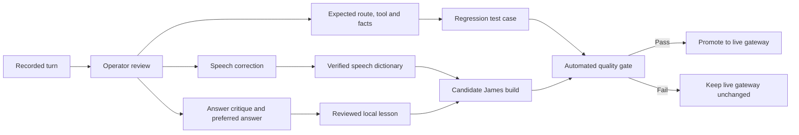

# Project James — Teaching and Response Improvement Plan

**Status:** Evidence-based implementation and verification plan
**Date:** 2026-08-21
**Scope:** Windows voice tester and Raspberry Pi 5 gateway
**Progress authority:** [Project TODO and Verification](Project-TODO-and-Verification.md)

> 🟢 **POINTS 1–5 IMPLEMENTED — 2026-08-21:** Feedback schema v2, the private
> 60-turn review queue, capability-aware multi-intent routing, unified context,
> answer-completion handling, single-flight Ollama admission control, explicit
> persistent memory, and read-only network/inference tools are deployed on
> Titanium. All 47 gateway tests and five Windows feedback/capture/replay tests pass.
> The live acceptance verifier passed the deterministic, mixed tool/model,
> memory, network, queue and previously truncated meltdown cases.
> The subsequent controlled speech acceptance passed 10/10 live cases through
> routing, TTS and synthesized Whisper loopback (2.61 s average chat response).

---

# 1. Decision

James should **not** be fine-tuned yet. The recordings show that most current
failures are caused by routing, tool selection, short-lived context, incomplete
capability awareness, feedback-recording errors, and response presentation.
Fine-tuning a model on those failures would preserve the wrong behaviour rather
than fix it.

The correct teaching system has five layers:

1. deterministic tools for measurements, current facts, and actions;
2. auditable routing and multi-intent handling;
3. verified speech corrections and explicit operator feedback;
4. persistent facts, preferences, and episodic memory with clear controls; and
5. model adaptation only after a clean, reviewed evaluation set exists.



No free-form correction should be applied directly to the live assistant until
its type and target turn are known.

---

# 2. Evidence reviewed

The review covered all files that contain recorded James interactions or
measurements. Configuration, dependency, build, example-template, and unrelated
JSON/CSV files were excluded.

| Evidence | Coverage | Interpretation |
|---|---:|---|
| Private session records | 60 turns | 39 PTT voice turns and 21 typed turns, including prompts, answers, routes, timing, corrections, tags and notes |
| Gateway telemetry JSONL | 390 events | Chat, STT, TTS, client timing, fallbacks, setting changes and one recorded HTTP error |
| Telemetry CSV | 390 corresponding rows | A tabular export of the same JSONL events, not an independent second dataset |
| Benchmark JSON | Four three-run benchmark series | General, weather, current-fact, local-model and STT-loopback timing across successive builds |
| Final smoke JSON | One run per route | A snapshot that exposed a severe current-fact/local-queue outlier |

The private recordings contain raw audio, but the privacy-safe telemetry does
not contain transcripts or raw audio. The gateway also reports no Whisper
confidence value because its current Whisper endpoint does not supply one.

## 2.1 Quantified session findings

| Measure | Result |
|---|---:|
| Recorded turns | 60 |
| Provider results | Gemini 40; Ollama 10; Pi status 3; weather 4; clock 2; Wikipedia 1 |
| Turns with issue tags | 7 |
| Turns with operator notes | 5 |
| Turns marked as fallback | 42 of 60 |
| Refusal-style responses detected | 8 |
| LLM median / p95 / maximum | 9.4 s / 34.1 s / 155.1 s |
| End-to-end median / p95 / maximum | 15.9 s / 37.8 s / 159.3 s |
| STT median / p95 | 2.2 s / 4.8 s |
| Average input level | −32.5 dBFS, with no clipping detected |

All 40 Gemini session results were marked as fallbacks, which means the tested
local-first policy often spent time on the Pi before escalating. Untagged turns
must not be treated as correct: only seven turns were explicitly issue-tagged,
so the labels are too sparse for supervised training without another review.

The session totals include older builds and real conversational contention, so
they are not the expected performance of every current route. Isolated later
benchmarks show approximately 1.5–1.8 seconds for a short Gemini-plus-TTS turn,
approximately 1.6–2.6 seconds for weather plus TTS, and roughly 2 seconds for a
warm short local turn. They also show 41–69 second current-fact outliers and a
155-second recorded fallback turn. Queueing, fallback and cold-path variance
remain release-blocking even when the warm median looks good.

## 2.2 Correction-data warning

The analyzer currently reports a 64.5% corrected-turn WER from five PTT pairs.
That number is **not a valid speech-accuracy result**. At least two stored
“corrected transcript” values are different later questions rather than the
words spoken in the associated audio. Another field contains conversational
feedback instead of a transcript correction. The likely cause is ambiguous
last-turn association combined with one field being used for different kinds of
feedback.

Until the schema is repaired, only correction pairs that are manually confirmed
against their `input.wav` may enter the speech dictionary or a WER calculation.

---

# 3. What actually went wrong

| Observed behaviour | Example from the recordings | Primary cause | Correct remedy |
|---|---|---|---|
| Refused or invented the current time | James denied clock access, invented 10:45 AM, and incorrectly described South African time | A model was asked for a deterministic host fact | Clock tool first; already implemented, retain regression tests |
| Dropped parts of a compound request | Weather plus time plus a nuclear question returned only the time | Router returns immediately after its first matched tool | Split multi-intent requests, execute safe tools, then compose one complete answer |
| Routed settings questions to weather | “temperature and … settings” returned Cape Town weather | Broad keyword matching without intent or object checks | Require a weather condition plus a location/current-weather relationship |
| Treated a request for weather code as a weather lookup | “Provide a script…” returned conditions or parsed “getting the” as a place | Tool matcher ignored the requested action and grammatical role | Classify lookup versus explanation versus code-generation intent before tool use |
| Used irrelevant Wikipedia grounding | Account privacy terms returned an article about X | Unconstrained search fallback accepted a weak result | Require query/result relevance and answerability thresholds; otherwise say the source is insufficient |
| Lost conversational reference | “Repeat point 3” and “generate point 3” produced unrelated content | Fragile three-turn in-memory context and no stable answer/item reference | Store every route result in one conversation ledger and resolve explicit follow-ups against it |
| Misstated its own capabilities | Claimed no sensors, diagnostics, local APIs, memory or update path despite deployed features | The model receives prose, not a live capability registry | Inject a gateway-generated capability manifest and provide a deterministic “what can you do?” response |
| Confused a sustained action with a snapshot | “Log Pi stats for five minutes” returned one status reading | Status keyword matched, but action duration was ignored | Add action semantics and a permissioned monitoring job; never claim logging without a job result |
| Failed to finish a correct answer | The Fukushima item was cut off and the follow-up could not recover it | Output ceiling and no completion/continuation check | Record provider finish reason, detect incomplete syntax/list items, and continue before TTS |
| Became sharp toward the operator | “You forgot…”, “actual logic”, complaints and breakage jokes | Wit targeted the user and appeared before/around the answer | Direct humour at the situation or machine, after the useful answer, never at the operator |
| Produced very slow fallback turns | 56–69 second benchmark outliers and one 155-second session turn | Overlapping local inference, cloud failure and unbounded queue recovery | Single-flight inference, visible queue depth, cancellation, strict stage deadlines and one bounded fallback |
| Recorded feedback against the wrong turn | A routing question was “corrected” to an EMO question | Mutable last-turn pointer and overloaded feedback field | Bind every feedback action to immutable `turn_id` and separate transcript, answer and routing feedback |

These are architecture and supervision problems. A larger model may phrase the
failure more elegantly, but it will not repair them.

---

# 4. Teaching data model

The next recording schema must store distinct feedback objects. A reviewed turn
should contain the following concepts; exact field names may change during
implementation.

```json
{
  "turn_id": "immutable UUID",
  "transcript_feedback": {
    "observed": "what Whisper returned",
    "corrected": "what was actually spoken",
    "audio_verified": true
  },
  "answer_feedback": {
    "rating": "wrong | partial | correct",
    "issue_tags": ["ignored_context"],
    "critique": "why the answer failed",
    "preferred_answer": "the answer James should have given"
  },
  "expected_behaviour": {
    "route": "tool | local | cloud",
    "tool": "weather.current",
    "must_include": ["all requested parts"],
    "must_not_include": ["unsupported capability claims"]
  },
  "review": {
    "approved_for_speech_dictionary": false,
    "approved_for_local_lesson": false,
    "approved_for_regression": true
  }
}
```

Rules:

- A transcript correction describes only the audio that belongs to that turn.
- A preferred answer is never stored in the transcript field.
- The original poor answer may be retained for diagnosis, but it is not a
  positive training example.
- Free-form notes are evidence, not automatically trusted instructions.
- Lessons cannot grant capabilities. Only the gateway capability registry and
  successful tool results can do that.
- Personally identifying audio and transcripts remain private and ignored by
  Git.

---

# 5. Implementation plan

## Phase A — Make feedback trustworthy

**Priority: P0 — do before collecting more training data**

- [x] Introduce recording schema version 2 with separate transcript, answer,
  route/tool, expected-answer and approval fields.
- [x] Bind “Teach STT” and “Flag shortcomings” to the displayed immutable
  `turn_id`, not a mutable last-completed file pointer.
- [x] Add **Correct / Partly correct / Wrong** and **Answer incomplete** controls.
- [x] Add a dedicated preferred-answer box and an expected-route/tool selector.
- [x] Require audio confirmation before a pair affects WER or reusable STT
  corrections.
- [x] Migrate the 60 existing turns into a review queue without automatically
  promoting their ambiguous correction fields.
- [x] Enhance the analyzer to report reviewed versus unreviewed data and to
  reject contaminated WER samples.

**Exit gate:** One correction can be traced from its button press to the same
turn UUID, WAV, transcript, critique and regression case.

## Phase B — Build a capability-aware deterministic core

**Priority: P0 — largest quality improvement per unit of work**

- [x] Generate a live capability registry from enabled tools and service health.
- [x] Use that registry for “What can you do?”, routing and honest
  degraded-mode answers.
- [x] Add multi-intent decomposition and answer composition; do not return after
  the first clock, weather or status match.
- [x] Replace broad keyword matching with intent contracts that identify the
  requested operation, object, location, time scope and duration.
- [x] Preserve every tool and model answer in the same conversation ledger.
- [x] Add explicit references to prior numbered items so “repeat point 3” is
  deterministic.
- [x] Record provider finish reason and run an answer-completion check before
  TTS, including list-item and mid-sentence detection.
- [x] Add single-flight inference admission control, bounded cancellation and
  queue telemetry.

**Exit gate:** All 60 recorded prompts replay without the known misroutes, lost
clauses or false capability claims. Expected historical facts may be frozen in
the test fixture where live values would naturally change.

## Phase C — Teach speech and response preferences safely

**Priority: P1**

- [ ] Re-listen to and approve the valid existing PTT correction pairs.
- [ ] Keep phrase/word corrections only when they recur or are project names,
  such as James, Titanium, Ollama, Gemini and ESP32-P4.
- [ ] Record a balanced 30–60 minute private corpus across normal, quiet,
  excited, tired and technical speech; use the existing VED Training workflow.
- [ ] Report WER and intent accuracy separately. A transcript can contain a word
  error while still selecting the right tool, and vice versa.
- [ ] Convert each approved answer correction into a compact rule plus an ideal
  example; never retrieve the bad answer as guidance.
- [ ] Add global response preferences: answer first, cover every requested part,
  no empty closing question, and dry wit only after the answer.
- [ ] Add a one-click “replay after correction” test in the Windows tester.

**Exit gate:** At least 50 audio-verified utterances and 50 reviewed answer cases
pass without introducing a regression in the deterministic tool suite.

## Phase D — Add persistent memory and useful tools

**Priority: P1 after Phase B**

- [x] Implement explicit **remember**, **forget**, **show what you remember** and
  retention controls for preferences and project facts.
- [x] Keep short conversational history separate from durable operator-approved
  memory.
- [ ] Implement scoped web retrieval with source relevance checks and citations
  for current public information.
- [ ] Add permissioned timers/reminders, sustained Pi monitoring, service-error
  summaries and approved local-document search.
- [x] Add deterministic read-only network/DNS/internet and Ollama queue-status
  tools; no shell or write interface is exposed.
- [ ] Log requested action, authorization, execution result and completion; James
  must not claim success from model text alone.

**Exit gate:** Reboot persistence, deletion, privacy boundaries, confirmation
and degraded operation are tested for each persistent/action tool.

## Phase E — Consider model adaptation

**Priority: P2/P3 — only after Phases A–D**

- [ ] Accumulate at least 200–500 human-approved prompt/ideal-answer examples
  covering normal conversation, corrections, abstention, tool use and tone.
- [ ] Keep a held-out evaluation set that is never used for adaptation.
- [ ] Compare prompt examples, retrieval, a stronger base model and LoRA before
  choosing fine-tuning.
- [ ] Train on a workstation or suitable NUC/server, not on the Pi 5.
- [ ] Deploy only a quantized inference artifact that meets the same route,
  correctness, latency, privacy and thermal gates.
- [ ] Retain rollback to the prior model and lesson store.

Fine-tuning should teach stable language behaviour and domain style. It should
not be used to memorize changing facts, simulate unavailable tools, repair STT,
or conceal routing defects.

---

# 6. Regression suite derived from the recordings

The first quality suite should contain at least these families:

| Family | Required checks |
|---|---|
| Local time | Correct South African time zone; uses clock tool; no internet refusal or invented time |
| Compound query | Weather, time and knowledge clauses all answered in order |
| Weather lookup | Named-place current conditions use weather tool |
| Weather-code request | Code-generation request is answered as code, not executed as a weather lookup |
| Personality settings | “temperature settings” is not routed to weather |
| Pi status | Snapshot requests use read-only status; sustained logging requires a monitoring job |
| Follow-up context | “repeat point 3” reproduces the actual third point |
| Capability truth | Reports only live tools and current provider state |
| Privacy/account terms | Does not substitute an irrelevant Wikipedia result |
| Current facts | Uses current grounding and cites a relevant source when asked |
| Offline/cloud failure | Gives a useful bounded fallback without pretending internet access |
| Completion | Every numbered or multi-part answer ends cleanly before TTS |
| Personality | Direct, warm, concise; no sarcasm at the operator; optional wit follows the answer |
| STT terminology | James, gateway, Titanium, Gemini, Ollama and ESP32-P4 transcribe correctly |

Every case should specify the expected route, allowed providers, required facts,
forbidden claims, maximum latency, and whether a clarifying question is
acceptable.

---

# 7. Acceptance targets

| Quality gate | Initial target |
|---|---:|
| Deterministic route accuracy | 100% on the clock, weather and Pi-status suite |
| Multi-part completion | 100%; no omitted clause or unfinished final item |
| False capability claims | 0 |
| False refusal when an enabled tool can answer | 0 |
| Irrelevant grounding accepted | 0 |
| Reviewed general-answer correctness | At least 95% on the held-out set |
| Clean-speech WER | At most 8%, reported on audio-verified references |
| Project-term recognition | At least 98% on the fixed terminology set |
| STT p95 | At most 3 seconds after microphone release |
| Tool answer before TTS | At most 1.5 seconds p95 on the LAN |
| Short cloud answer before TTS | At most 4 seconds p95 when service is healthy |
| Local-model deadline | At most 8 seconds; cancel before fallback |
| Spoken response start | Median at most 6 seconds; p95 at most 12 seconds for ordinary turns |

Cloud quota exhaustion and network loss should be measured separately rather
than averaged into healthy-service latency.

---

# 8. Immediate execution order

1. Repair turn-linked feedback and split correction types.
2. Convert the 60 existing turns into a reviewed regression queue.
3. Implement capability registry, multi-intent composition and stricter intent
   contracts.
4. Fix answer completion, queue cancellation and follow-up context.
5. Retest the exact failed prompts through the Windows tester.
6. Add persistent memory and the first approved action tools.
7. Collect clean speech and preferred-answer data.
8. Reassess model/host choice only after the architectural defects are removed.

This sequence teaches James by turning each correction into a verified system
behaviour, not by asking a model to remember that it was wrong.
